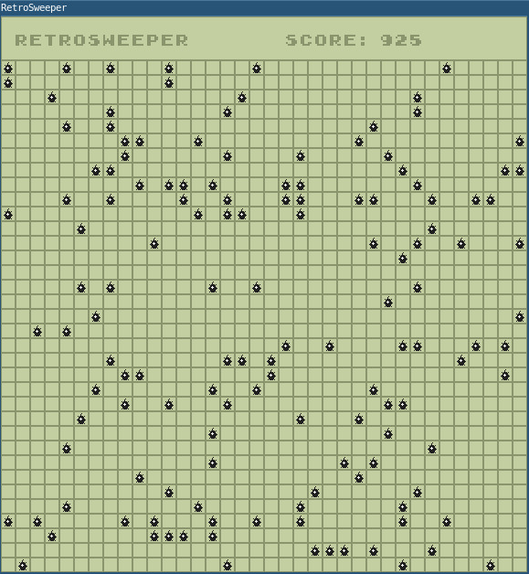

# RetroSweeper
An implementation of the classical Minesweeper game using C++ and SDL2.
Uses SDL_Image, SDL_TTF and SDL_FontCache as additional libraries.

The game was made as simple pet project and is not yet optimized.

# Screenshot

# Tutorial

Click on the fields to play the game. If you click on a mine, you lose.
